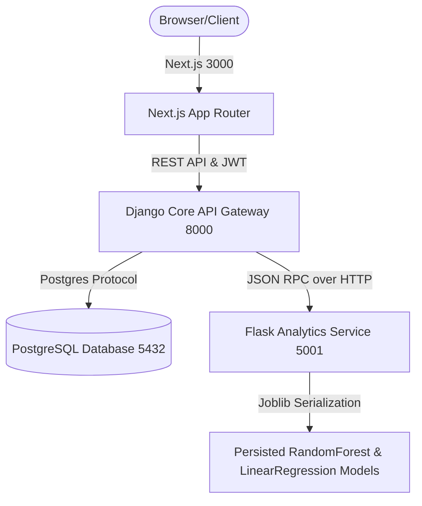

# FleetGuard - Enterprise Fleet Management System

Welcome to the production release of **FleetGuard**, an enterprise-grade Fleet Management System designed for large-scale logistics operations. The system integrates standard fleet modules, an AI-powered prediction microservice, security logging audits, system health checks, database backups, and customizable company settings.

---

## 1. Project Architecture Diagram

The system employs a decoupled, multi-tiered microservices architecture:



---

## 2. Tech Stack

- **Frontend**: Next.js 15 (App Router), TypeScript, Tailwind CSS, shadcn/ui, TanStack Query, Axios, Framer Motion, Recharts.
- **Backend Core**: Django, Django REST Framework, SimpleJWT Authentication, Django Cache Framework.
- **AI Analytics Service**: Flask, Python, Pandas, NumPy, Scikit-Learn, Joblib.
- **Database**: PostgreSQL.
- **Orchestration**: Docker, Docker Compose.

---

## 3. Folder Tree Structure

```text
Fleet-Final/
├── docker-compose.yml        # Multi-container orchestration config
├── README.md                 # Project architecture & setup documentation
├── analytics/                # Flask Microservice (AI Analytics)
│   ├── app.py                # Flask main router & health service
│   ├── train.py              # ML Classifier model generator & fitting script
│   ├── Dockerfile            # Flask container image specifications
│   ├── requirements.txt      # Scientific packages listing
│   ├── dataset/              # Simulated training data CSV files
│   └── trained_models/       # Persisted joblib models
├── backend/                  # Django REST Framework (Backend Core API)
│   ├── Dockerfile            # Django container image specifications
│   ├── requirements.txt      # Backend libraries listing
│   ├── manage.py             # CLI command admin tool
│   ├── config/               # Settings & core routing configurations
│   ├── accounts/             # User profiles, auth and demo seeding
│   └── fleet/                # Modules (Vehicles, Drivers, Trips, Fuel, Maintenance, Audit, Settings)
│       ├── ai_service.py     # Django client proxy layer connecting to Flask service
│       ├── logging_utils.py  # User activity audit-log recorder
│       ├── models.py         # DB Schemas (AuditLog, SystemSettings, etc)
│       ├── views.py          # CRUD REST views, settings, and database backups
│       └── urls.py           # Endpoint router configs
└── frontend/                 # Next.js 15 App Router (Frontend)
    ├── Dockerfile            # Next.js container image specifications
    ├── app/                  # Router path pages
    │   ├── dashboard/        # Operations console
    │   │   ├── fleet-intelligence/ # Sprint 5 AI console (Maintenance, Drivers, Fuel, Health, Recs)
    │   │   ├── settings/     # Sprint 6 system settings, health monitors, backups control
    │   │   ├── profile/      # User profile, password reset, and access logs
    │   │   ├── layout.tsx    # Responsive sidebar & state context
    │   │   └── page.tsx      # Premium metrics dashboards & AI Cards grid
    │   ├── error.tsx         # Professional 500 error boundary recovery page
    │   └── not-found.tsx     # Professional 404 router disruption page
    ├── components/           # UI elements (shadcn wrappers)
    └── lib/                  # Services & API Axios clients (api.ts)
```

---

## 4. Key Enterprise Features

1. **Fleet Logistics CRUD modules**: Complete management of Vehicles, Drivers (with license expiry warning notifications), Trips (with journey status tracking), Refueling Log Ledgers, and Repair Maintenance logs.
2. **AI Predictive Fleet Intelligence**:
   - **Predictive Maintenance**: Failure risk probabilities built with RandomForest classifiers.
   - **Fuel consumption forecast**: Linear regression modeling predicting fuel volume based on cargo weight and mileage distance parameters.
   - **Safety rank index**: Safety score rating tracking driver operators.
   - **Health gauges**: SVG circular progress dials rendering diagnostic benchmarks.
3. **Database Backup & Recovery**: Exports/imports complete JSON table archives of vehicles, drivers, trips, fuel logs, maintenance records, and audit logs.
4. **Operations Audit Trail**: Automatically tracks user IP addresses, actions (Sign-ins, Logouts, Vehicle Updates, Trip Dispatches, Fuel and Service entries), and displays them inside the profile page.
5. **Monitoring Console**: Checks real-time health statuses for the Django backend, local PostgreSQL database connectivity, and the Flask AI service.

---

## 5. PostgreSQL Database Configuration

Configure your database connection inside `backend/config/settings.py` or customize your environment variables matching:

- **Database**: `fleet_management_db`
- **Host**: `localhost`
- **Port**: `5432`
- **Username**: `postgres`
- **Password**: `2004`

---

## 6. Environment Variables (`.env`)

Create a `.env` file in the root workspace folder to feed environment configuration:

```env
# Database Connections
DB_HOST=localhost
DB_PORT=5432
DB_NAME=fleet_management_db
DB_USER=postgres
DB_PASSWORD=2004

# AI Analytics Service URLs
FLASK_API_URL=http://localhost:5001

# Demo Admin Seed Account Credentials
SEED_ADMIN_EMAIL=yuvashrim28@gmail.com
SEED_ADMIN_PASSWORD=admin@123
```

---

## 7. Installation & Execution Guide

### Local Native Execution

#### A. Database Migration
1. Ensure your local PostgreSQL instance is running with `fleet_management_db` database created.
2. Create and active the virtual environment in `backend/`:
   ```bash
   cd backend
   python -m venv venv
   # Windows:
   venv\Scripts\activate
   # Linux/macOS:
   source venv/bin/activate
   ```
3. Install dependencies and run migrations:
   ```bash
   pip install -r requirements.txt
   python manage.py makemigrations accounts fleet
   python manage.py migrate
   ```
4. Seed the default administrator account credentials:
   ```bash
   python manage.py seed_admin
   ```

#### B. Start AI Analytics Microservice
1. Navigate to the `analytics/` folder:
   ```bash
   cd analytics
   python -m venv venv
   # Windows:
   venv\Scripts\activate
   ```
2. Install libraries:
   ```bash
   pip install -r requirements.txt
   ```
3. Run training script to fit Scikit-Learn models:
   ```bash
   python train.py
   ```
4. Host the Flask REST endpoints:
   ```bash
   python app.py
   ```

#### C. Start Django API Backend Core
In the backend folder, run the development server:
```bash
python manage.py runserver 0.0.0.0:8000
```

#### D. Start Next.js Frontend Client
1. Navigate to `frontend/`:
   ```bash
   cd frontend
   npm install --legacy-peer-deps
   ```
2. Start the dev client:
   ```bash
   npm run dev
   ```
Open [http://localhost:3000](http://localhost:3000) to login using:
- **Email**: `yuvashrim28@gmail.com`
- **Password**: `admin@123`

---

## 8. Docker Support & Orchestration

To compile and launch all microservices in a synchronized production container context:

1. Build and download dependencies for the multi-container environment:
   ```bash
   docker compose build
   ```
2. Start the container stacks:
   ```bash
   docker compose up -d
   ```
This automatically sets up:
- PostgreSQL database on port `5432`
- Flask AI analytics endpoint on port `5001`
- Django backend API core on port `8000` (auto-seeds the admin account)
- Next.js client on port `3000`

To tear down the containers:
```bash
docker compose down -v
```

---

## 9. Verification & Testing

### Django Backend Unit Tests
To run django API integration tests:
```bash
cd backend
venv\Scripts\activate
python manage.py test fleet
```

### TypeScript Validation
To run next compiler checks:
```bash
cd frontend
npx tsc --noEmit
```

---

## 10. Future Enhancements

- Integration with physical hardware GPS trackers via WebSockets.
- Automated route schedule mapping utilizing geographic APIs.
- AI chat interface for direct operations queries.
