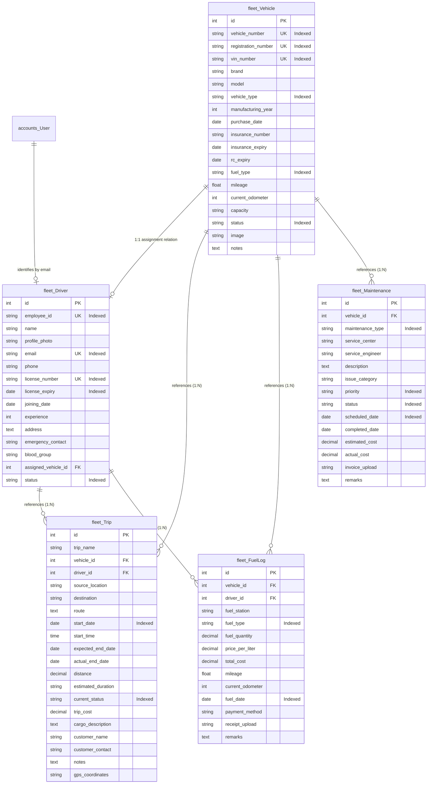

# FleetGuard - Enterprise Fleet Management System (Sprint 3)

Welcome to Sprint 3 of the enterprise-grade Fleet Management System (**FleetGuard**). This repository contains the foundation, database schemas, API models, JWT role permissions framework, responsive dashboards, and CRUD pages.

---

## 1. Folder Tree Structure

```text
Fleet-Final/
├── .env.example              # Global environment variables template
├── README.md                 # Project architecture & setup documentation
├── analytics/                # Flask Microservice (Analytics)
│   ├── app.py                # Flask entry point and health checks
│   └── requirements.txt      # Flask dependencies
├── backend/                  # Django REST Framework (Backend Core)
│   ├── accounts/             # Authentication & User Management app
│   │   ├── migrations/       # Database migrations
│   │   ├── models.py         # Custom User model (Admin, Manager, Driver)
│   │   ├── serializers.py    # Custom User & Token payload serializers
│   │   ├── urls.py           # Authentication routing
│   │   └── views.py          # DRF views (Register, Login, Profile, Logout)
│   ├── config/               # Settings & routing configuration
│   │   ├── settings.py
│   │   └── urls.py
│   ├── fleet/                # Fleet Management App (Vehicles, Drivers, Trips, Fuel, Maintenance)
│   │   ├── migrations/       # Database migrations (including Sprint 3 models)
│   │   ├── models.py         # Vehicle, Driver, Trip, FuelLog, Maintenance models
│   │   ├── serializers.py    # Serializers with strict validations & relationships
│   │   ├── permissions.py    # Custom Role-Based Access Control permissions
│   │   ├── tests.py          # Comprehensive API unit and integration tests
│   │   ├── urls.py           # ViewSet routers configuration
│   │   └── views.py          # ViewSet logic, filters, sorting & search views
│   ├── manage.py             # Django admin CLI
│   └── requirements.txt      # Django dependencies
└── frontend/                 # Next.js 15 App Router (Frontend)
    ├── app/                  # App routes & layout entry
    │   ├── dashboard/        # Dashboard layout & content
    │   │   ├── layout.tsx    # Collapsible sidebar, profile controls & global search dropdown
    │   │   ├── page.tsx      # Main KPIs dashboard (Trips, Costs, Utilization, Schedules)
    │   │   ├── vehicles/     # Vehicles directory & detail profiles
    │   │   ├── drivers/      # Drivers directory & profiles with license warnings
    │   │   ├── trips/        # Trips scheduling CRUD & journey details timeline
    │   │   ├── fuel/         # Fuel logs CRUD, monthly costs & responsive SVG trends
    │   │   └── maintenance/  # Maintenance calendar schedules & invoice logs
    │   ├── login/            # Interactive Login page
    │   ├── register/         # Form validation Register page
    │   └── providers.tsx     # TanStack Query & Toast providers
    ├── components/           # Reusable UI component library
    │   └── ui/               # Custom workspace wrappers (Button, Modal, Select, Input, Skeleton, Toast)
    ├── lib/                  # Utility libraries & Axios clients
    │   ├── api.ts            # JWT auto-refresh interceptors & CRUD API services
    │   └── utils.ts          # Styling helper
    ├── package.json          # Next.js dependencies & scripts
    └── tsconfig.json         # TypeScript compiler preferences
```

---

## 2. Database Schema

The system uses a PostgreSQL database with a custom accounts schema and relationships:



---

## 3. Installation Guide

### Backend Setup
1. Open a terminal and navigate to the `backend/` directory:
   ```bash
   cd backend
   ```
2. Create and activate a Python virtual environment:
   ```bash
   python -m venv venv
   # Windows CMD:
   venv\Scripts\activate.bat
   # macOS/Linux:
   source venv/bin/activate
   ```
3. Install dependencies:
   ```bash
   pip install -r requirements.txt
   ```

### Frontend Setup
1. Navigate to the `frontend/` directory:
   ```bash
   cd frontend
   ```
2. Install npm packages:
   ```bash
   npm install
   ```

---

## 4. Run Commands

### Run Backend (Django)
1. **Apply migrations**:
   ```bash
   python manage.py migrate
   ```
2. **Seed Admin**:
   ```bash
   python manage.py seed_admin
   ```
3. **Start backend**:
   ```bash
   python manage.py runserver
   ```

### Run Frontend (Next.js)
```bash
npm run dev
```

---

## 5. API Endpoints Summary

### Authentication APIs
| Method | Endpoint | Auth | Description | Payload Schema |
| :--- | :--- | :--- | :--- | :--- |
| **POST** | `/api/auth/register` | AllowAny | Creates user and signs in immediately | `{"fullName", "email", "password", "confirm_password", "role"}` |
| **POST** | `/api/auth/login` | AllowAny | Obtains JWT access & refresh tokens | `{"email", "password"}` |
| **POST** | `/api/auth/refresh` | AllowAny | Obtains fresh access token via refresh token | `{"refresh"}` |
| **POST** | `/api/auth/logout` | IsAuthenticated | Blacklists refresh token | `{"refresh"}` |
| **GET** | `/api/auth/profile` | IsAuthenticated | Retrieves details of authenticated user | *None* |

### Fleet Core APIs (Vehicles & Drivers)
| Method | Endpoint | Auth | Role restrictions | Description |
| :--- | :--- | :--- | :--- | :--- |
| **GET** | `/api/vehicles/` | IsAuthenticated | Driver (filtered to own) | Lists active vehicles |
| **POST** | `/api/vehicles/` | IsAuthenticated | Admin / Fleet Manager | Creates vehicle record |
| **GET** | `/api/vehicles/{id}/` | IsAuthenticated | Driver (filtered to own) | Retrieves vehicle details |
| **PUT** | `/api/vehicles/{id}/` | IsAuthenticated | Admin / Fleet Manager | Updates vehicle record |
| **DELETE** | `/api/vehicles/{id}/` | IsAuthenticated | Admin Only | Deletes vehicle record |
| **GET** | `/api/drivers/` | IsAuthenticated | Driver (filtered to own) | Lists drivers |
| **POST** | `/api/drivers/` | IsAuthenticated | Admin / Fleet Manager | Registers operator profile |
| **PUT** | `/api/drivers/{id}/` | IsAuthenticated | Admin / Fleet Manager | Updates operator profile |

### Transit Operations APIs (Trips, Fuel, Maintenance)
| Method | Endpoint | Auth | Role restrictions | Description |
| :--- | :--- | :--- | :--- | :--- |
| **GET** | `/api/trips/` | IsAuthenticated | Driver (filtered to own) | Lists scheduled trips |
| **POST** | `/api/trips/` | IsAuthenticated | Admin / Fleet Manager | Schedules new trip |
| **PUT** | `/api/trips/{id}/` | IsAuthenticated | Driver (status-only), Manager (all) | Updates trip parameters |
| **DELETE** | `/api/trips/{id}/` | IsAuthenticated | Admin / Fleet Manager | Cancels and deletes trip |
| **GET** | `/api/fuel/` | IsAuthenticated | Admin / Fleet Manager | Lists refueling ledger logs |
| **POST** | `/api/fuel/` | IsAuthenticated | Admin / Fleet Manager | Records fuel refueling event |
| **GET** | `/api/maintenance/` | IsAuthenticated | Admin / Fleet Manager | Lists scheduled maintenance |
| **POST** | `/api/maintenance/` | IsAuthenticated | Admin / Fleet Manager | Schedules repair ticket |

### Business Intelligence & Analytics APIs (Sprint 4)
| Method | Endpoint | Auth | Role restrictions | Description |
| :--- | :--- | :--- | :--- | :--- |
| **GET** | `/api/dashboard/` | IsAuthenticated | Driver (filtered to own) | Retrieves general stats, health indices, active vehicles and expiries |
| **GET** | `/api/dashboard/kpi/` | IsAuthenticated | Driver (filtered to own) | Retrieves performance KPIs (Repair costs, distances, cost per KM) |
| **GET** | `/api/dashboard/charts/` | IsAuthenticated | Driver (filtered to own) | Retrieves aggregated charts trends for monthly metrics and status maps |
| **GET** | `/api/dashboard/recent-activities/` | IsAuthenticated | Driver (filtered to own) | Retrieves chronological feed of recent events |
| **GET** | `/api/dashboard/notifications/` | IsAuthenticated | Driver (filtered to own) | Retrieves warning flags (insurances, licenses, maintenance) |
| **GET** | `/api/reports/fleet/` | IsAuthenticated | Driver (filtered to own) | Retrieves overall fleet statistics table rows |
| **GET** | `/api/reports/vehicle/` | IsAuthenticated | Driver (filtered to own) | Retrieves filtered vehicles inventory report rows |
| **GET** | `/api/reports/driver/` | IsAuthenticated | Driver (filtered to own) | Retrieves filtered driver operator rosters |
| **GET** | `/api/reports/trips/` | IsAuthenticated | Driver (filtered to own) | Retrieves trip dispatch logs spreadsheet |
| **GET** | `/api/reports/fuel/` | IsAuthenticated | Driver (filtered to own) | Retrieves refueling logs transactions ledger |
| **GET** | `/api/reports/maintenance/` | IsAuthenticated | Driver (filtered to own) | Retrieves maintenance work order tickets spreadsheet |

### AI Analytics & Predictions Gateway (Sprint 5)
| Method | Endpoint | Auth | Role restrictions | Description |
| :--- | :--- | :--- | :--- | :--- |
| **GET** | `/api/ai/maintenance/` | IsAuthenticated | Driver (filtered to own) | Predicts vehicle maintenance failure risk probabilities |
| **GET** | `/api/ai/fuel/` | IsAuthenticated | Driver (filtered to own) | Models future trip fuel consumption and load efficiency |
| **GET** | `/api/ai/driver-score/` | IsAuthenticated | Driver (filtered to own) | Aggregates safety performance indexes for operators ranking |
| **GET** | `/api/ai/fleet-health/` | IsAuthenticated | Driver (filtered to own) | Computes overall fleet diagnostic health indexes |
| **GET** | `/api/ai/cost-forecast/` | IsAuthenticated | Driver (filtered to own) | Projects monthly expenses for fuel and services |
| **GET** | `/api/ai/recommendations/` | IsAuthenticated | Driver (filtered to own) | Lists AI operations optimization recommendations |

---

## 6. AI Analytics Microservice Setup (Sprint 5)

The AI Microservice runs on a Flask REST server and operates Scikit-Learn models trained on simulated datasets.

### Model Training
To generate the training datasets and build/save the ML classifiers:
1. Navigate to the `analytics/` folder:
   ```bash
   cd analytics
   ```
2. Run the training script using the python environment:
   ```bash
   python train.py
   ```
   This will train the Random Forest and Linear Regression models and save them to `trained_models/`.

### Run Flask Server
To start the microservice locally:
```bash
python app.py
```
By default, the server will start on port `5001`.

---

## 7. Testing Instructions

### Django API Validation
To execute the automated unit and integration tests verifying date/cost validations, status checks, and role permissions:
```bash
cd backend
python manage.py test fleet
```

### Next.js Compile Verification
To compile-check all routes, component bindings, and types:
```bash
cd frontend
npm run build
```
